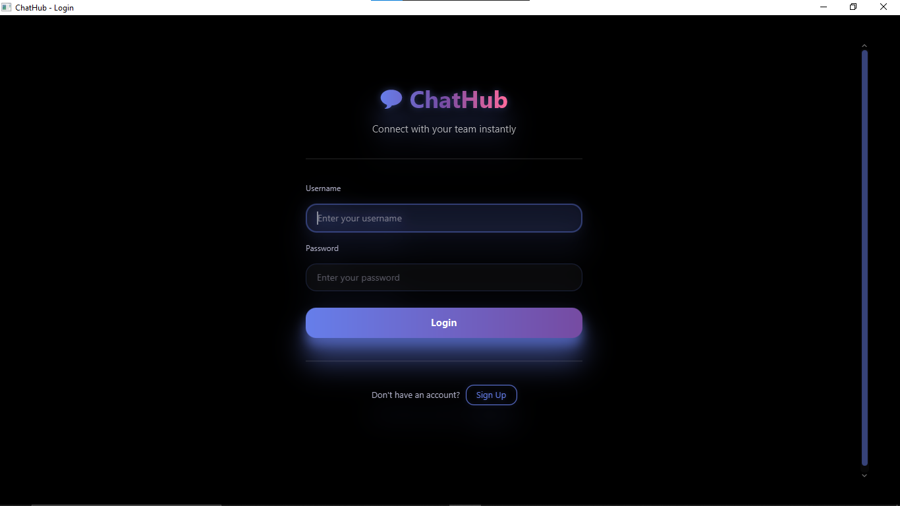
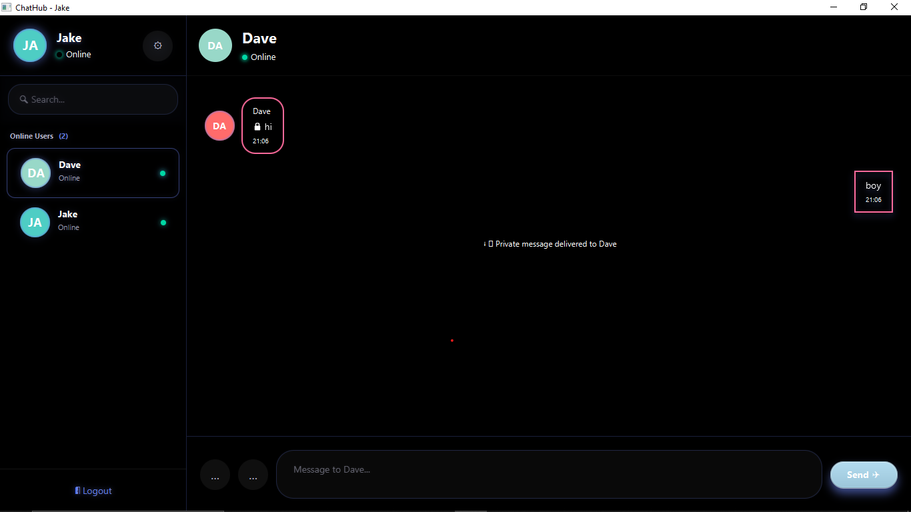
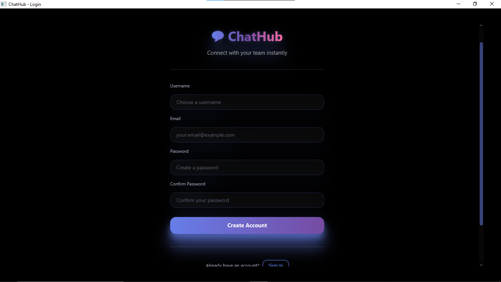

# 💬 ChatHub - Java Desktop Chat Application

A modern desktop chat application built with **Java, JavaFX, and MySQL**. Real-time one-on-one messaging with a responsive UI.


## ✨ Key Features

- **One-on-One Messaging** - Private conversations with real-time delivery
- **User Authentication** - Secure login and registration
- **Online Status** - See who's online in real-time
- **File Sharing** - Send files up to 5MB
- **Typing Indicators** - Know when someone is typing
- **Responsive UI** - Modern dark theme with smooth animations

---

## 📸 Screenshots

 Login Screen    
 -----------------------------
 
 
 Chat Interface     
 -----------------------------
 
 
 Registration Screen                       
 ----------------------------------------- 
  

---

## 🛠️ Tech Stack

| Layer               | Technology                  |
| ------------------- | --------------------------- |
| **UI Framework**    | JavaFX 17+                  |
| **Language**        | Java 17+                    |
| **Database**        | MySQL 8.0+                  |
| **Connection Pool** | HikariCP                    |
| **Build Tool**      | Maven 3.8+                  |
| **IDE**             | IntelliJ IDEA (Recommended) |

---

## 📋 Prerequisites

Before you begin, ensure you have the following installed:

- **Java Development Kit (JDK)** 17 or higher
  - [Download JDK 17+](https://www.oracle.com/java/technologies/downloads/)
- **MySQL Server** 8.0 or higher
  - [Download MySQL](https://dev.mysql.com/downloads/mysql/)
- **Maven** 3.8 or higher
  - [Download Maven](https://maven.apache.org/download.cgi)
- **Git** (for version control)

  - [Download Git](https://git-scm.com/)

- **IntelliJ IDEA** (Optional but recommended)
  - [Download IntelliJ IDEA](https://www.jetbrains.com/idea/)

### Verify Installation

```bash
# Check Java version
java -version

# Check Maven version
mvn -version

# Check Git version
git --version

# Check MySQL version
mysql --version
```

---

## 🚀 Installation

### 1. Clone the Repository

```bash
git clone https://github.com/yourusername/ChatHub.git
cd ChatHub
```

### 2. Create Database

```bash
# Connect to MySQL
mysql -u root -p

# Create the database
CREATE DATABASE chatapp_db;
USE chatapp_db;

# Create users table
CREATE TABLE users (
    id INT AUTO_INCREMENT PRIMARY KEY,
    username VARCHAR(50) UNIQUE NOT NULL,
    password VARCHAR(255) NOT NULL,
    created_at TIMESTAMP DEFAULT CURRENT_TIMESTAMP
);

# Create messages table
CREATE TABLE messages (
    id INT AUTO_INCREMENT PRIMARY KEY,
    sender_id INT NOT NULL,
    receiver_id INT NOT NULL,
    content TEXT NOT NULL,
    timestamp TIMESTAMP DEFAULT CURRENT_TIMESTAMP,
    FOREIGN KEY (sender_id) REFERENCES users(id),
    FOREIGN KEY (receiver_id) REFERENCES users(id)
);
```

### 3. Configuration

#### Copy Environment Template

```bash
# Copy the example env file
cp .env.example .env
```

#### Edit .env File

Open `.env` in your favorite editor and fill in your database credentials:

```env
# Database Configuration
DB_URL=jdbc:mysql://localhost:3306/chatapp_db
DB_USER=root
DB_PASSWORD=your_mysql_password_here
DB_HOST=localhost
DB_PORT=3306
DB_NAME=chatapp_db

# Application Configuration
APP_PORT=8080
APP_HOST=localhost
```

**Important:** Never commit the `.env` file to version control. It's already in `.gitignore`.

### 4. Install Dependencies

```bash
# Clean and build the project
mvn clean install

# Or just compile (faster)
mvn compile
```

---

## ⚙️ Configuration

### Environment Variables

The application uses an `EnvConfig` utility class to load variables from `.env` file:

```java
// In your code:
String dbUrl = EnvConfig.get("DB_URL", "jdbc:mysql://localhost:3306/chatapp_db");
String password = EnvConfig.get("DB_PASSWORD", "");
```

### Security Best Practices

✅ **DO:**

- Use `.env.example` as a template
- Load credentials from environment variables
- Never hardcode sensitive data
- Use `.gitignore` to exclude `.env` files

❌ **DON'T:**

- Commit `.env` files to Git
- Hardcode passwords in source code
- Share credentials in pull requests
- Use default passwords in production

---

## 🏃 Running the Application

### Option 1: Using IntelliJ IDEA (Recommended)

1. **Open the Project**

   - File → Open → Select ChatHub folder
   - Wait for Maven to sync dependencies

2. **Configure JDK**

   - File → Project Structure → Project
   - Set Project SDK to Java 17+

3. **Run the Application**
   - Find `ChatApplication.java` in `src/main/java/com/chatapp/`
   - Right-click → Run 'ChatApplication.main()'
   - Or press `Ctrl+Shift+F10` (Windows/Linux) or `Ctrl+Shift+R` (Mac)

### Option 2: Using Maven Command Line

```bash
# Compile
mvn compile

# Run the application
mvn javafx:run

# Or package and run JAR
mvn clean package
java -jar target/ChatApplication.jar
```

### Option 3: Using IDE Run Configuration

**File → Edit Configurations:**

- Click "+" → Application
- Main class: `com.chatapp.ChatApplication`
- VM options: `--module-path /path/to/javafx-sdk/lib --add-modules javafx.controls,javafx.fxml`
- Working directory: `$PROJECT_DIR$`
- Click Run

---

## 📁 Project Structure

```
ChatHub/
├── src/
│   └── main/
│       ├── java/com/chatapp/
│       │   ├── ChatApplication.java          # Application entry point
│       │   ├── client/
│       │   │   ├── ChatClient.java           # Client connection handler
│       │   │   └── controller/
│       │   │       ├── ChatController.java   # Main chat UI controller
│       │   │       ├── LoginController.java  # Login screen controller
│       │   │       └── RegistrationController.java
│       │   ├── server/
│       │   │   ├── ChatServer.java           # Server main class
│       │   │   ├── ServerHandler.java        # Individual client handler
│       │   │   └── UserManager.java          # User management logic
│       │   ├── database/
│       │   │   ├── DatabaseConfig.java       # DB connection setup
│       │   │   ├── UserDAO.java              # User database operations
│       │   │   └── MessageDAO.java           # Message database operations
│       │   ├── model/
│       │   │   ├── User.java                 # User model
│       │   │   ├── Message.java              # Message model
│       │   │   └── FileTransfer.java         # File transfer model
│       │   └── util/
│       │       ├── EnvConfig.java            # Environment config loader
│       │       ├── EncryptionUtil.java       # Password encryption
│       │       └── NetworkUtil.java          # Network utilities
│       └── resources/com/chatapp/
│           ├── view/
│           │   ├── chat.fxml                 # Chat screen UI
│           │   ├── login.fxml                # Login screen UI
│           │   └── registration.fxml         # Registration screen UI
│           └── css/
│               └── style.css                 # Application styles
├── pom.xml                                   # Maven configuration
├── .env.example                              # Environment template
├── .env                                      # Environment variables (ignored)
├── .gitignore                                # Git ignore rules
└── README.md                                 # This file
```

---

## 💻 Usage Guide

### Starting the Application

1. **Run the Application** (see Running section above)
2. **Login Screen appears**

### First Time Users

1. **Create Account**

   - Click "Don't have an account? Register here"
   - Enter username and password
   - Click "Register"
   - Login with your new credentials

2. **Login**
   - Enter username and password
   - Click "Login"
   - Wait for connection to establish

### Using the Chat

1. **Select a User**

   - Browse the online users list on the left
   - Click on any user to start chatting

2. **Send Messages**

   - Type your message in the text area
   - Press `Enter` to send
   - Or press `Shift+Enter` for a new line

3. **Share Files**

   - Click the 📎 attachment button
   - Select a file (max 5MB)
   - File is sent instantly

4. **Add Emojis**

   - Click the 😊 emoji button
   - Select from quick emoji picker

5. **Search Users**
   - Use the search box to find users by name
   - Results update as you type

### Typing Indicators

- When you start typing, other users will see "Someone is typing..."
- Indicator disappears after 3 seconds of inactivity

---

## 🔐 Security & Best Practices

### Database Credentials

**Never expose credentials:**

✅ **Correct:**

```bash
# In .env file
DB_PASSWORD=your_secure_password
```

❌ **Wrong:**

```java

```

### Strong Passwords

```bash
# Use strong database passwords with:
# - Uppercase letters (A-Z)
# - Lowercase letters (a-z)
# - Numbers (0-9)
# - Special characters (!@#$%^&*)
# - Minimum 12 characters

# Example: P@ssw0rd#SecureDB2024
```

### .gitignore Configuration

The following files are excluded from Git:

- `.env` (Database credentials)
- `*.log` (Log files)
- `users.dat` (User data files)
- `.idea/` (IDE settings)
- `target/` (Build artifacts)

### Environment Variables

Instead of .env file, you can use system environment variables:

**Windows (Command Prompt):**

```cmd
setx DB_URL "jdbc:mysql://localhost:3306/chatapp_db"
setx DB_USER "root"
setx DB_PASSWORD "your_password"
```

**Linux/Mac (Terminal):**

```bash
export DB_URL="jdbc:mysql://localhost:3306/chatapp_db"
export DB_USER="root"
export DB_PASSWORD="your_password"
```

---

## 🐛 Troubleshooting

### Issue: "Failed to initialize database"

**Solution:**

1. Check MySQL is running: `mysql --version`
2. Verify .env file exists and has correct credentials
3. Verify database exists: `mysql -u root -p -e "SHOW DATABASES;"`
4. Check HikariCP logs for connection errors

### Issue: "Cannot find JavaFX"

**Solution:**

```bash
# Add to pom.xml dependencies
<dependency>
    <groupId>org.openjfx</groupId>
    <artifactId>javafx-controls</artifactId>
    <version>20</version>
</dependency>
```

Then run: `mvn clean install`

### Issue: "Port 8080 already in use"

**Solution:**

1. Change the port in `.env`: `APP_PORT=8081`
2. Or kill the process: `lsof -i :8080` then `kill -9 <PID>`

### Issue: Users can see each other's messages

**Solution:**

- This is by design - messages are filtered by selected user
- To debug: Check `selectedUser` variable in ChatController

### Issue: File transfer fails

**Solution:**

- Check file size < 5MB
- Verify both users are connected
- Check file permissions in your system

---

## 🤝 Contributing

1. Fork the repository
2. Create a feature branch: `git checkout -b feature/your-feature`
3. Make your changes
4. Commit: `git commit -m "Add your feature"`
5. Push: `git push origin feature/your-feature`
6. Open a Pull Request

---

## 📄 License

This project is licensed under the MIT License - see the LICENSE file for details.

---

## 📞 Support

- 📧 Email: your.email@example.com
- 🐛 Issues: [GitHub Issues](https://github.com/yourusername/ChatHub/issues)
- 💬 Discussions: [GitHub Discussions](https://github.com/yourusername/ChatHub/discussions)

---

## 🎯 Roadmap

- [ ] Persistent message storage in database
- [ ] Message encryption (End-to-End)
- [ ] Group chat support
- [ ] Voice/video calling
- [ ] Message reactions and emojis
- [ ] User profile customization
- [ ] Dark/Light theme toggle
- [ ] Message search functionality
- [ ] User blocking feature
- [ ] Read receipts

---

**Made with JavaFX by [4DESOL4]**
